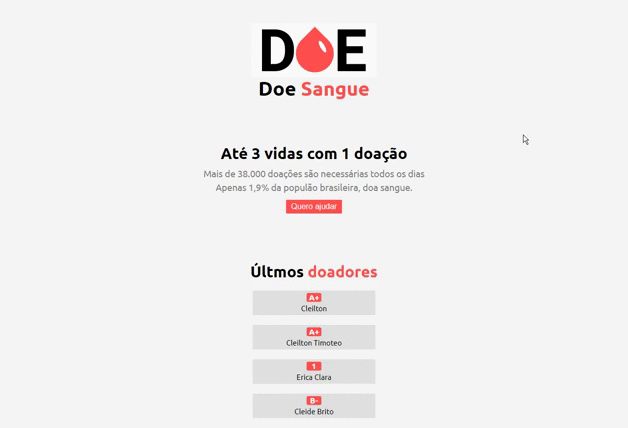

## :bulb: Sobre
Criando uma aplicação com javascript para aprendizado.
Quando você cadastra-se no formulario, você entra para a lista de doadores.

## :wrench:  Tecnologias
- NodeJS
- PostgreSQL
- JavaScript
- HTML
- CSS

## :nut_and_bolt:  Dependencias
- express
- nodemon
- nunjucks
- pg

## :running: :dash:  Start
1. Baixe ou clone o repositorio.
2. Clonando: git clone https://github.com/cleiltont/donate-blood.git
3. No arquivo server linha 13, preencha os dados com o seu banco de dados.
4. Abra o terminal na pasta donate-blood e digite: npm start

## :books:  Aprendizado
- Criar um servidor com Node
- Conectar-se co banco de dados com Node
- Enviar informações para o banco de dados
- Mostra dados do banco no html

Feito com :heart: by Cleilton Timoteo

...

credits: rocketseat